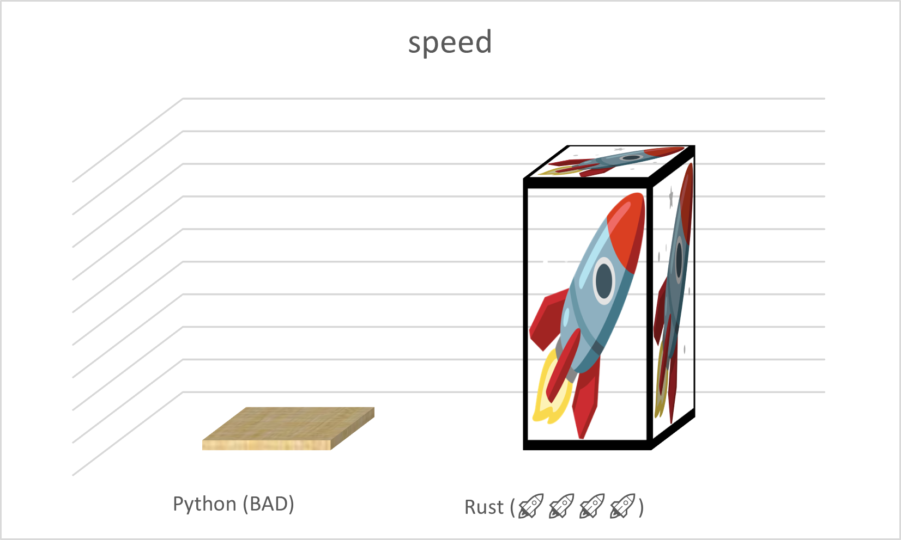

# r10k simulator

This is a simulator of R10k-style OOO data structures for a computer architecture homework assignment. i make no guarantees to this code because i am shit.

However, it is written in blazing fast🔥🔥🔥🔥🔥🔥🔥🔥 memory-safe ***Rust***(🚀). Therefore 🚀🚀🚀🚀🚀 it must be 🚀🚀🚀really  🚀good 🚀🚀🚀🚀🚀🚀🚀🚀. 🚀🚀🚀🚀🚀🚀🚀🚀
🔥🔥🔥🔥🔥🔥🔥🔥🔥🔥🔥🔥
🚀🚀🚀🚀🚀🚀🚀🚀🚀🚀🚀🔥🔥🔥🔥🔥🔥

# Simulator Benchmark 🚀🚀🚀

As you can see, Rust(🚀) version is faster.